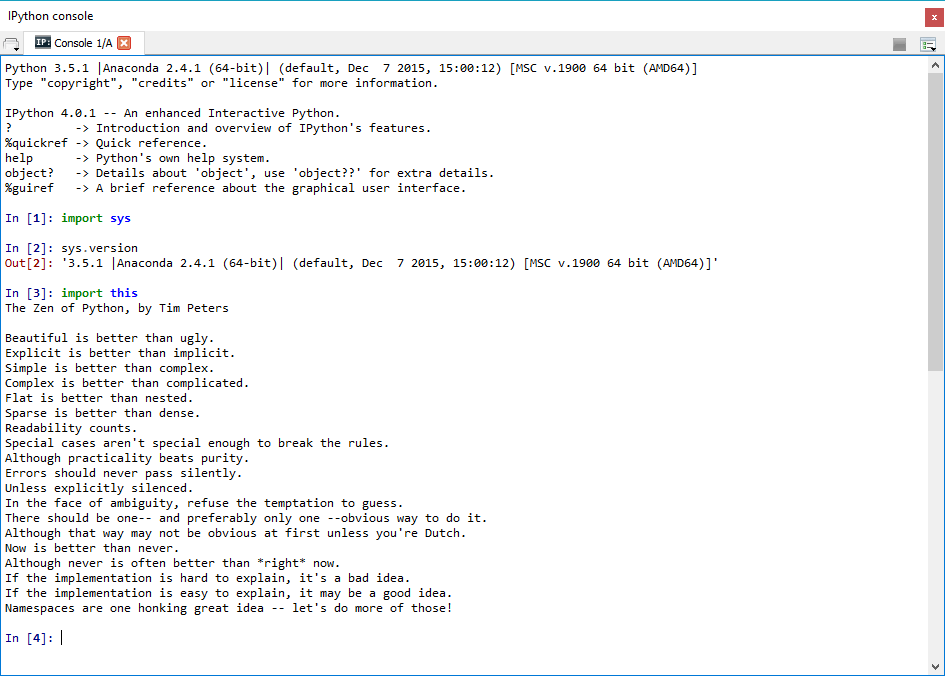

UECM3033 Assignment #1 Report
========================================================

- Prepared by: Ching June Tao
- Tutorial Group: T2

--------------------------------------------------------

## Task 1 -- setup a github repository

The reports, codes and supporting documents are uploaded to Github at: 

[https://github.com/chingjunetaoUTAR/UECM3033_assign1](https://github.com/chingjunetaoUTAR/UECM3033_assign1)

---------------------------------------------------------

## Task 2 -- setup python

Put here the screen shot of file (python.png)

------------------------------------------------------------

## Task 3 -- modify and run Python script

In this section, please report:

1. The hexadecimal value of your student ID.
   
Hexadecimal representation of 1202462 is 0x12591e 

2. Write down the definite integrals that you have chosen.
  
$$\int_0^{\pi} \frac{1}{2}sin{x}  dx = 1.$$

3. Write down your system of 10 linear equations.

My system of 10 linear equations : 
\begin{align} x_1 +x_2 + x_3 +x_4 + x_5 +x_6 + x_7 +x_8 + x_9 +x_{10} &= 55,\\
5x_1 +2x_2 + x_3 +x_4 + x_5 +x_6 + x_7 +x_8 + x_9 +x_{10} &= 61,\\
x_1 +3x_2 + x_3 +4x_4 + x_5 +x_6 + 2x_7 +x_8 + x_9 +2x_{10} &= 88,\\
x_1 +x_2 + x_3 +5x_4 + x_5 +8x_6 + x_7 +6x_8 + x_9 +3x_{10} &= 173,\\
x_1 +7x_2 + x_3 +7x_4 + x_5 +4x_6 + x_7 +x_8 + 2x_9 +x_{10} &= 118,\\
x_1 +6x_2 + x_3 +6x_4 + x_5 +2x_6 + x_7 +3x_8 + x_9 +5x_{10} &= 147,\\
x_1 +4x_2 + x_3 +5x_4 + x_5 +9x_6 + x_7 +2x_8 + x_9 +6x_{10} &= 183,\\
5x_1 +x_2 + 3x_3 +x_4 + 6x_5 +x_6 + x_7 +x_8 + 4x_9 +x_{10} &= 117,\\
x_1 +2x_2 + x_3 +2x_4 + x_5 +4x_6 + x_7 +6x_8 + x_9 +2x_{10} &= 129,\\
x_1 +2x_2 + x_3 +5x_4 + x_5 +2x_6 + x_7 +7x_8 + x_9 +9x_{10} &= 207.\\
\end{align}

Answer : 
\begin{align} x_1 =1, x_2 =2,x_3 =4,x_4 =4,x_5=5,\\
x_6 =6,x_7 =7,x_8 =8,x_9 =9,x_{10} =10.
\end{align}

Here are the examples of how to add equations in markdown:

$$\int_0^{\infty} e^{-x^2} dx = \frac{\sqrt{\pi}}{2}.$$

\begin{align*}
3 x_0 +x_1 &= 9,\\
x_0 + 2 x_1 &= 8.
\end{align*}

-----------------------------------
In case Github does not render my equations, you may view the equations in the following Editor.
[Markdown Editor](https://stackedit.io/editor)

or please refer to my report in pdf file format.
UECM3033 Assignment 1_ChingJuneTao_report.pdf

-----------------------------------
last modified: 25/01/2016
 
